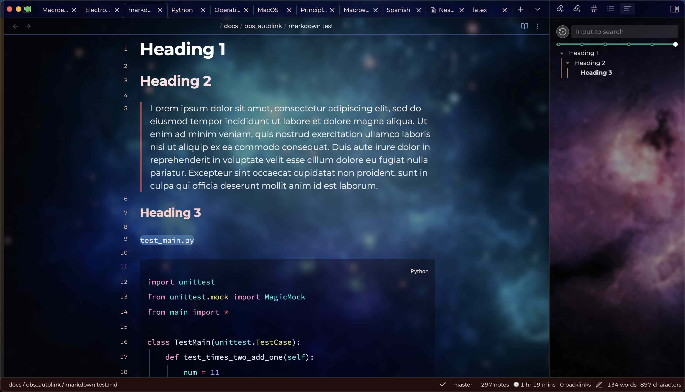
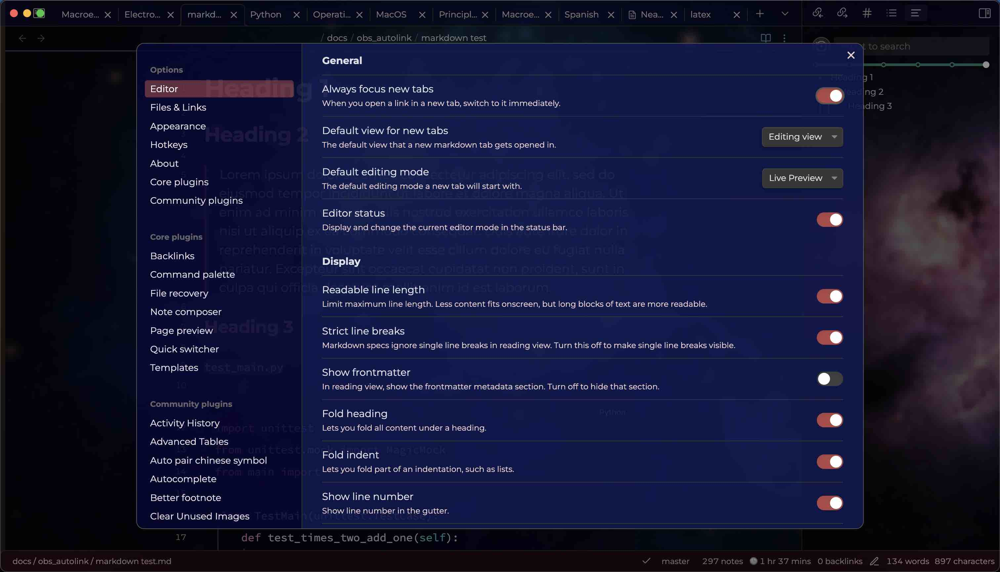
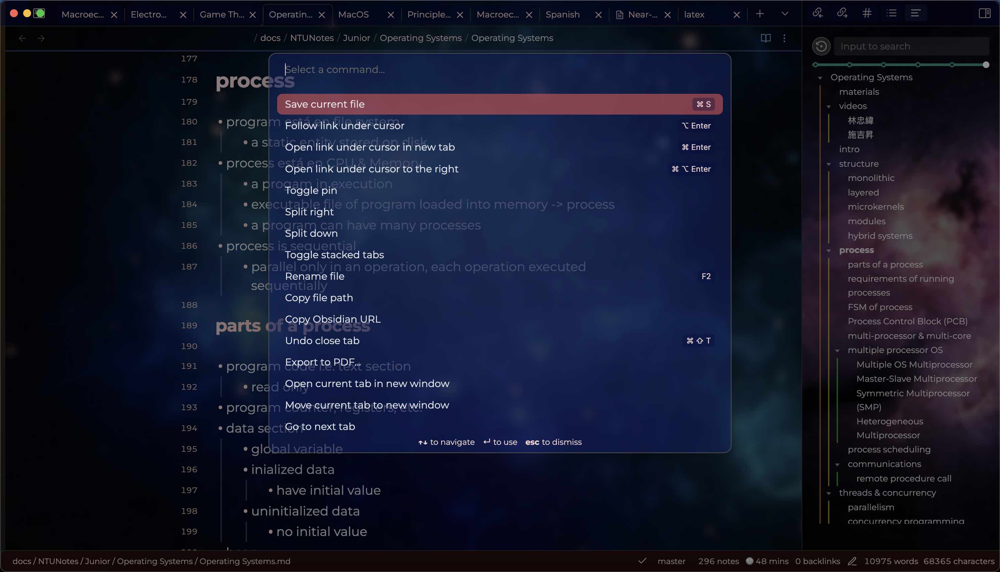

# Nebula

Note that this theme minimizes the leftmost vertical bar, where the multiple tools are at. The reason is that I don't use it at all as I use keyboard shortcuts and the command palette to access most things. If you need it, either overwrite it with custom CSS snippets (try altering classes with `side-dock-ribbon` as prefix) or use other themes instead.

